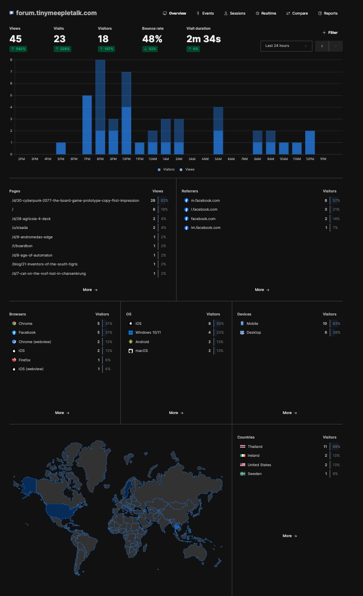

พอเริ่มลอง hosting website เองแล้ว (ทั้งตัว webboard กับ blog) ก็มีความเห่อนิดหน่อยอยากรู้เหมือนกันว่ามีใครมาส่องเวบเราบ้าง เลยไปหาข้อมูลเพิ่มหน่อยว่าจะใส่ analytic ลงไปใน Flarum (ที่ใช้ทำตัวเวบบอร์ด) กับ Astro (ที่ใช้ทำ blog ) ยังไง แน่นอนล่ะว่าที่แรกคือคนทั่วไปคิดก็คือ google analytic จิ้มๆไม่กี่ที่ก็เรียบร้อย

แต่....

พอเริ่มหาข้อมูลก็จะมีคนแนะนำกันแหละว่าเห้ยจริงๆ GA (Google Analytic) มันช้ามันขายดาต้าคุณ ซึ่งเอาจริงๆผมก็ไม่ได้แคร์เรื่องโดนขายข้อมูลซักกะนิด แต่เท่าที่ดูพวกบทความเค้าก็จะแนะนำตัวเลือกอื่นๆก็ลองอ่านดูแล้วที่คิดว่าน่าสนใจคือ Umami เพราะจริงๆแล้วเราต้องการแค่แทรคดูอะไรง่ายๆเท่านั้นเอง และแน่นอนที่สนใจเพราะมันมีตัวเลือกให้ self host เองด้วยตรงกับความอยากลองของเล่นเราพอดี

ทีนี้จะวางไว้ไหนล่ะ? ใน Vultr ที่ใช้กับ Flarum ผมก็เช่า VPS ไว้มีแรมแค่ 1GB ส่วน Blog นี้น่ะเหรอ? ใช้ RackNerd ที่แรมมีแค่ 0.768GB เล็กไปอี๊ก ถาม ChatGPT แล้วก็ถือว่าค่อนข้าง tight อยู่ ตอนแรกก็คิดว่าหรือจะไปใช้บริการฟรีของ Umami (แทรคได้ 3 เวบ) หรือไปเช่าเพิ่มดีนะ พลันสายตาก็เหลือบไปเห็น PI 3 ที่เคยซื้อกะมาทำ smart home เมื่อซัก 7 ปีก่อนก็เลยมีไอเดียว่ามันจะเอามาใช้ได้ไหมหว่าก็เลยเริ่มจากถาม ChatGPT เจ้าเดิม

##### ของที่ผมใช้
- **Raspberry Pi 3 Model B v1.2** (จริงๆอันไหนก็คงได้แหละ)
- **Raspberry Pi OS Lite 64 bit** 
- **Docker + Docker Compose** (ไม่เคยใช้เหมือนกัน แต่เอาจริงไม่มีไรหรอก)
- **Cloudflare account** (ฟรี)
- **A domain name** (พอดีมีอยู่แล้ว)
##### เอาล่ะมาลงมือกันดีกว่า

ขั้นตอนไม่ได้วุ่นวายอะไร เอา Pi3 มา flash ลง Pi OS Lite 64 bit แล้วก็เลือกให้ login ผ่านเครื่องที่มี SSH key เท่านั้นเพื่อความปลอดภัย จากนั้นก็ login เข้าไปผ่าน terminal

```
ssh pi@raspberrypi.local 
//pi นี้ชื่อ user ที่เราตั้งตอน flash ถ้าไม่ตั้งจะมี pi เป็น default ให้ 
//raspberrypi.local นี้จะใช้ ip address ตรงก็ได้ ชื่อนี้ก็แล้วแต่เราตั้งตอน flash เหมือนกัน 
```

ตามด้วยติดตั้ง docker 

```
curl -fsSL https://get.docker.com -o get-docker.sh && sh get-docker.sh
sudo apt install docker-compose -y
```

ติดตั้ง Umami

```
git clone https://github.com/umami-software/umami.git
cd umami
```

เพื่อความปลอดภัยเราจะเพิ่ม security เข้าไปอีกหน่อยด้วยการจำกัด port 

```
sudo apt install ufw
sudo ufw default deny incoming
sudo ufw allow ssh
sudo ufw allow 80
sudo ufw allow 443
sudo ufw enable
```

เอาละมา run docker เลย
```
docker-compose up -d
```

ระหว่างทางเอาจริงๆก็ติดปัญหาจุกจิกนิดหน่อย พวก permission ไรงี้ แต่ก็เอาไปถามๆ ChatGPT เอามีจุดหนึ่งที่พลาดมากๆคือมันจะตอบแล้วอิงว่าเรา user ชื่อ pi แต่พอดีเราใช้ชื่อมันเลยพัง ก็ต้องระวังตรงนี้นิดนึง

โดยตอนนี้เราก็น่าจะ login เข้า umami ผ่าน ip ตรงๆได้ละ
##### เอาล่ะ แล้วเวบของเราจะมาต่อกับ Pi ยังไงนิ? แล้วบ้านฉันจะโดน hack ไหม?

ท่าที่ง่ายที่สุดและโคตรไม่แนะนำคือ เปิด port ให้โลกรู้กันไปเลย แค่มี ip ก็ลิงค์เข้ามาตรงๆได้ ez .... ซึ่งยับแน่นอน

วิธีที่ผมใช้คือ Cloudflare Tunnel ครับ ซึ่งประโยชน์ของมันคือ
- ป้องกัน DDoS
- ไม่เผยข้อมูล network ของเราออกไป
- ตั้ง domain name เองได้ (แบบ analytics.mysite.com ไรงี้)
- และมันฟรีเว้ย

ขั้นตอนไม่ได้ยุ่งยากอะไรเริ่มจากไปเปิด account ที่ cloudflare ก่อน พวก setup domain จะขอข้ามไป จากนั้นกลับมาที่ terminal ใน pi ของเรา เราก็จะติดตั้ง cloudflare tunnel ไปด้วยคำสั่ง

```
curl -fsSL https://github.com/cloudflare/cloudflared/releases/latest/download/cloudflared-linux-arm64.deb -o cloudflared.deb
sudo dpkg -i cloudflared.deb

สังเกตุว่าใช้ version arm64.deb นะ เพราะ pi ของเราติด os64bit
```

พอเรียบร้อยก็ login ด้วย 
```
cloudflared tunnel login
```
มันจะพิมพ์ url มาให้เราอันนึงก็เอาไปใส่ brower แล้ว confirm

เรียบร้อยก็สร้างทางเข้าด้วย

```
cloudflared tunnel create myanalytics //myanalytics นี้ชื่อไรก็ได้
```

ต่อไปเราจะเตรียม config ด้วย
```
mkdir -p ~/.cloudflared
nano ~/.cloudflared/config.yml
```

หน้าตาประมาณนี้
```
tunnel: myanalytics <--- ใชชื่อเดียวกันกับ tunnel ข้อก่อนหน้า
credentials-file: /home/<user ของคุณ>/.cloudflared/myanalytics.json

ingress:
  - hostname: myanalytics.mysite.com
    service: http://localhost:3000
  - service: http_status:404

```

จากนั้นก็สั่งตั้งค่า DNS
```
cloudflared tunnel route dns myanalytics myanalytics.mysite.com
cloudflared tunnel run umami
```

ถ้าไม่มีอะไรผิดพลาดก็ควรจะเข้าได้ละ แต่เอาจริงๆตอนผมทำก็ติดโน้นนี้อยู่เหมือนกัน ฮาๆ
```
https://myanalytics.mysite.com
```

สำหรับการ tracking สำหรับ Astro ก็จะไปหาไฟล์ที่เป็น base layout ของ theme ที่เราใช้ ปกติจะอยู่แถวๆ
==src/layouts/BaseLayout.astro== ก็ไปใส่แบบก่อน `</head>` นิดนึง

```
<script
  async
  defer
  data-website-id="YOUR-UMAMI-WEBSITE-ID" 
  src="https://myanalytics.mysite.com/script.js"
></script>
```

> ตัว ID ตอน setup umami เพื่อเพิ่มเวบที่จะให้ tracking มันจะมีให้กด edit แล้วไปดู id ได้ ก็ไปเอามาใส่นะ

ของ Flarum ก็ใช้ script เดียวกัน (แต่เปลี่ยน ID) แต่เอาไปใส่ไว้ตรงหน้า Admin แล้วไปที่ **"Appearance"** → **Custom Header** แล้วก็แปะลงไป.

เท่านี้ก็เรียบร้อย 



---

ส่วนประหยัดได้เท่าไรประหยัดจริงไหม ไปดูมา Pi 3 กินไฟประมาณ 1.4W - 4.7W เนื่องจากเราแทบไม่ได้ใช้อะไร ขอถัวเฉลี่ยว่า 3W ละกัน

```
ยูนิต = (วัตต์ x ช.ม.) / 1,000  
= (3W x 24 ช.ม. x 31 วัน ) / 1,000  
= 3.23 unit
```

ก็ตกเดือนละไม่ถึง 20 บาทครับ ถูกกว่าเช่า VPS ใน racknerd อีก!! แถมได้ reuse เครื่องเก่ามาใช้ หลอกตัวเองกับบอกเมียได้อีกว่าประหยัดไปอีกหลายพัน 

แต่เอาจริงๆถ้าไปใช้ของฟรีกับ Umami โดยตรงก็ฟรีนะได้แทรคได้ตั้ง 3 เวบ แต่เอาน่าเดี๋ยวไม่สนุก

---
